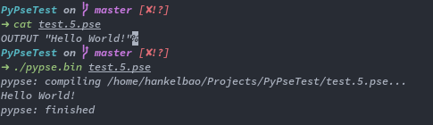

# [P](#)y[P](#)se - A Pseudocode Compiler in Python

## Introduction

PsPse is a interpreted compiler for teaching purposes.

Features:

* Compile codes in AS-Level Computer Science Syllabus
* Portable with no environemt requirements
* Available in Windows and Linux
* Continuously developing

I am senior high students learning A2 currently, and I am new to comiplers. The project is still under heavy developing. Feel free to raise issues or contribute.



## Why?

Pseudocode is used to express ideas without truly writing code. However,

* AS-Level has specific grammar for this language
* AS-Level International Test marks based on the grammar
* There is no compiler for it, and there is no way to test it or execute it.

As a result, there is a clear need to write such compiler, also as a project of mine for interest. :smirk:

## Get Started

First, Clone the repo in terminal:

```
git clone https://github.com/HankelBao/PyPseTest
```

Now, you will have the PyPseTest folder in your current path. CD to it and you will have `pypse.bin` and `pypse.exe` under the folder.

If you are using Windows, 

```
.\pypse.exe test.5.pse
```

If you are using Linux, 

```
.\pypse.bin test.5.pse
```

If you see the *Hello World!* message showing up just like the demo, you are ready to go!

## Usage

Remember, you should always use `pypse.bin` for linux and `pypse.exe` for windows.

Pseudocode File ends in **.pse**, so you should create a file with such extension for execution.

Write your own pseudocode and execute it!


## Contributing

The compiler is currently **not** fully functioning and there may be some bugs.

If you want to see the debug info for the compiler, call the command with *--debug*

For example

```
.\pypse.exe test.5.pse --debug
```

Feel free to report issues and make contributions.

## Promote

Spread it around your classes if you also find the need for such a compiler!

Thanks for your support.